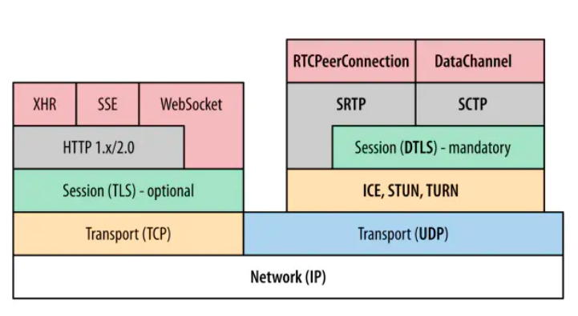

# 聊聊 webRTC

## 前言

### 3D 项目截图

- 使用技术？
- 如何进行可视化操作？

## 1 What

### 1-1 RTC

> RTC（Real time communication）实时通信。

#### 特点

关键词：实时性、清晰度、流畅度。

#### TCP & UDP

- TCP 是面向连接的可靠传输协议，为数据传输的完整性和有序性提供了保障；
- UDP 是无连接的不可靠传输协议，数据传输的可靠性完全交由应用层处理。

#### 实时音视频，为什么优先选择 UDP？

- 实时音视频对于延迟特别敏感，ITU StandardG.114 对延时的定义是，端到端延时大于 400ms 时，用户的交互体验将受到明显的影响。
- TCP 协议的可靠性和高吞吐量导致延时，而少量数据包丢失对于视频通话影响其实并不大。

因此 WebRTC 在**信令控制**方面采用了可靠的 TCP，但是**音视频数据传输**方面采用了 UDP。

### 1-2 webRTC

#### 介绍

在[MDN](https://developer.mozilla.org/zh-CN/docs/Web/API/WebRTC_API)中，对 WebRTC 的简要描述为:

> WebRTC（Web Real-Time Communications）是一项实时通讯技术，它允许网络应用或者站点，在不借助中间媒介的情况下，建立浏览器之间点对点（Peer-to-Peer）的连接，实现视频流和（或）音频流或者其他任意数据的传输。WebRTC 包含的这些标准使用户在无需安装任何插件或者第三方的软件的情况下，创建点对点（Peer-to-Peer）的数据分享和电话会议成为可能。

#### 历史背景

2010 年 5 月，Google 以 6820 万美元收购 VoIP 软件开发商 Global IP Solutions 的 GIPS 引擎，并改为名为“WebRTC”。WebRTC 使用 GIPS 引擎，实现了基于网页的视频会议，并支持 722，PCM，ILBC，ISAC 等编码，同时使用谷歌自家的 VP8 影片解码器；同时支持 RTP/SRTP 传输等。

2012 年 1 月，谷歌已经把这款软体整合到 Chrome 浏览器中。同时 FreeSWITCH 专案宣称支援 iSAC audio codec。

#### web 视频主要组成部分

`getUserMedia` 为一个 RTC 连接获取设备的摄像头与 (或) 麦克风权限，并为此 RTC 连接接入设备的摄像头与 (或) 麦克风的信号。

`RTCPeerConnection` 用于配置音频或视频聊天。

`RTCDataChannel` 用于设置两个浏览器之间的端到端 (en-US) 数据连接。

## 2 Why

#### 2-1 优缺点

优点：

- WebRTC 已被纳入 W3C 标准，跨平台
- 实时性，低延迟

缺点：

- 不适用参与者过多的场景

#### 2-2 应用场景

因此而衍生的应用包括视频会议、连麦、远程控制、云游戏等。

## 3 How

### 3-1 流程

### STUN TURN

STUN（Session Traversal Utilities for NAT，NAT 会话穿越应用程序）是一种网络协议，它允许位于 NAT（或多重
NAT）后的客户端找出自己的公网地址，查出自己位于哪种类型的 NAT 之后以及 NAT 为某一个本地端口所绑定的
Internet 端端口。这些信息被用来在两个同时处于 NAT 路由器之后的主机之间创建 UDP 通信。该协议由 RFC 5389 定
义。

TURN 的全称为 Traversal Using Relays around NAT，是 STUN/RFC5389 的一个拓展，主要添加了 Relay 功能。如果
终端在 NAT 之后， 那么在特定的情景下，有可能使得终端无法和其对等端（peer）进行直接的通信，这时就需要公网
的服务器作为一个中继， 对来往的数据进行转发。这个转发的协议就被定义为 TURN。

### 信令

> [信令是在两个设备之间发送控制信息以确定通信协议、信道、媒体编解码器和格式以及数据传输方法以及任何所需的路由信息的过程。关于 WebRTC 的信令流程最重要的一点是：**信令在规范中并没有定义。**所以开发者需要自己决定如何实现这个过程。开发者可以为应用程序引擎选择任意的信息协议（如 SIP 或 XMPP），任意双向通信信道（如 WebSocket 或 XMLHttpRequest) 与持久连接服务器的 API](https://developer.mozilla.org/zh-CN/docs/Web/API/WebRTC_API/Session_lifetime)

### ICE candidate

ICE (Interactive Connectivity Establishment)，客户端之间的打洞能力的武器，通过 ICE 检测后，客户端之间可能存在多个通信链路，由 ICE 选择出最高效的链路。

1. 收集 Candidate

2. 对 Candidate Pair 排序

3. 连通性检查
